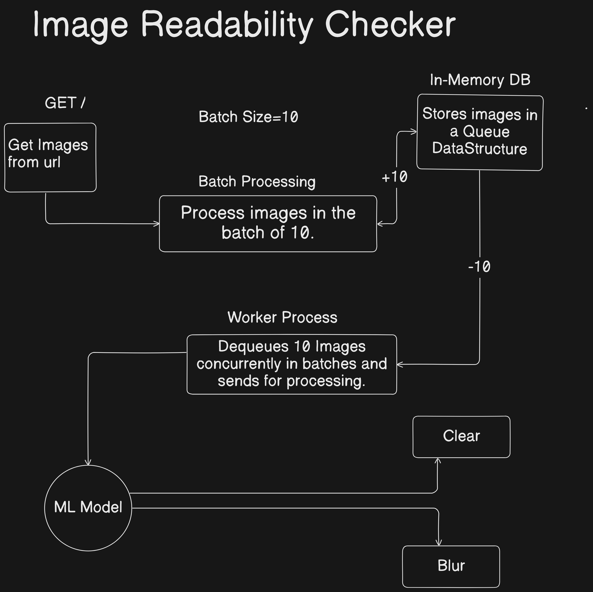

# UPLOAD REDIS

    /upload-redis
    This route will upload the images in List(queue data structure) in the redis.
    /start-worker
    This will start the redis worker and start dequeing the images to process them entirely.
